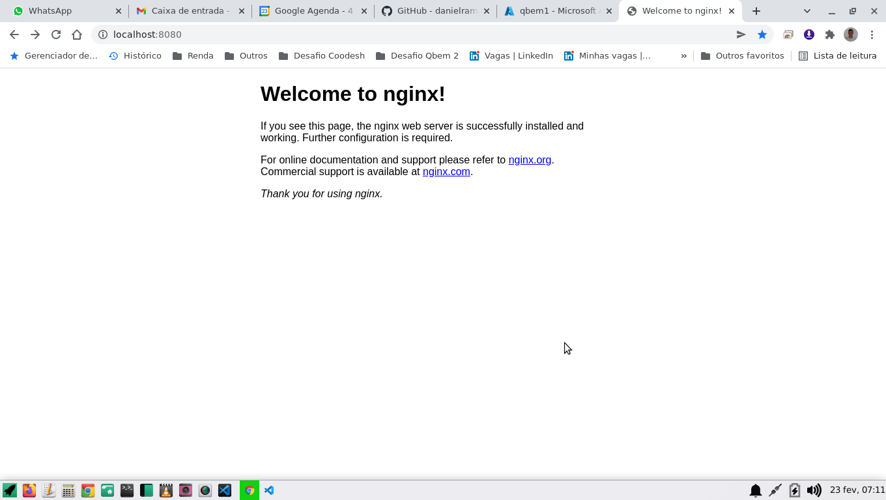
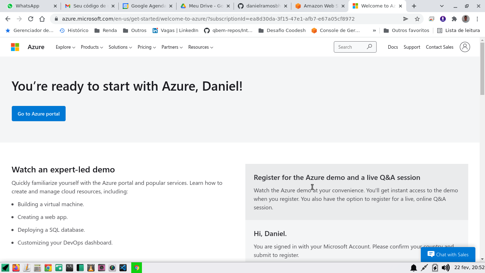
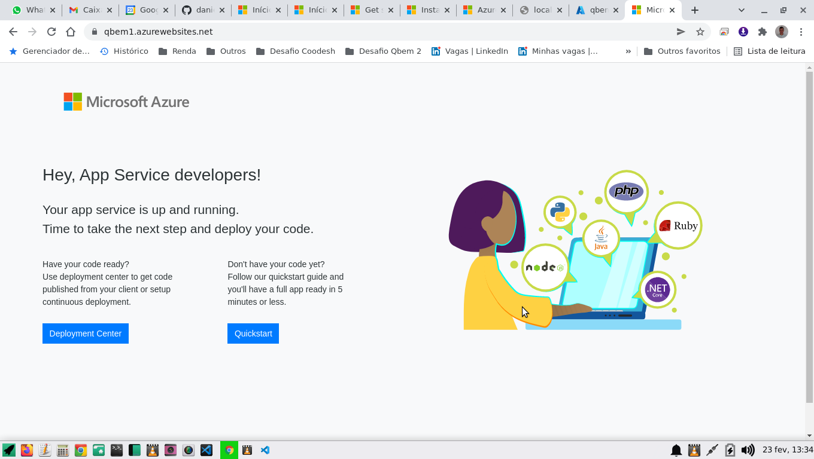

# Interview.Devops

- [x] 1. Criar um repositorio no github

- [x] 2. Colocar nesse repositorio um Dockerfile com um Nginx

- **Observação**
O Dockerfile foi colocado no repositório e o Nginx está rodando localmente como uma imagem Docker, mas ficou uma dúvida:
Da forma como configurei o Dockerfile, apenas os arquivos alterados na pasta pública do Nginx serão alterados, não será possível alterar as suas configurações via repositório Github, apenas entrando no container dele. Não acho que está "errado", mas talvez seja melhor uma outra abordagem, como colocar TODOS os arquivos do Nginx no repositório do Github.

- [x] 3. Criar uma conta na Azure ( Free )

- [x] 4. Criar na azure um Cluster ACS

https://qbem1.azurewebsites.net/

**Observações**
1. Além de criar o Cluster ACS, já fiz, _manualmente_ também o _primeiro_ upload da imagem Docker do Nginx, pois acho importante aprender primeiro "manualmente" e repetir o processo algumas vezes, para, depois, automatizar o processo.

2. Pensei que fosse mostrar a tela inicial de boas-vindas do index.html do Nginx, mas mostrou esta tela inicial do ACS. 
É isso mesmo? (Continuarei testando... irei editar e publicar um index.html simples)

- [ ] 5. Via **Github Action** subir a imagem no ACS

- [ ] 6. Liberar acesso publico, porém somente na porta 80
